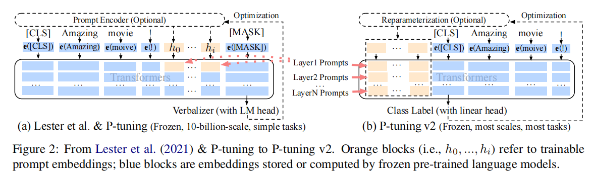

## PromptBERT

> paper: PromptBERT: Improving BERT Sentence Embeddings with Prompts
>
> author: Ting Jiang1, Shaohan Huang, Zihan Zhang, Deqing Wang, Fuzhen Zhuang , Furu Wei, Haizhen Huang, Liangjie Zhang , Qi Zhang
>
> institute: Beihang University, Microsoft

## P-Tuning v2 (2022 ACL)

> paper:P-Tuning v2: Prompt Tuning Can Be Comparable to Fine-tuning Universally Across Scales and Tasks
>
> author:Xiao Liu1,2∗, Kaixuan Ji1∗, Yicheng Fu1∗, Weng Lam Tam1, Zhengxiao Du1,2,Zhilin Yang1,3†, Jie Tang1,2†
>
> institute: THU
>
> code: https://github.com/THUDM/P-tuning-v2.
>
> ---
>
> main：重点解决了**Prompt tuning在小模型上效果不佳的问题**，并将Prompt tuning拓展至更复杂的NLU任务，如MRC答案抽取、NER实体抽取等序列标注任务。
>
> * finetuning耗费很大，ptuning只需要调0.1%-3%的参数就有差不多的效果，但是现阶段效果不太好
>
> * 跑了很多任务证明
>
> point：
>
> * 合理优化的PT能比得上FT的性能
> * 在每一层都加连续prompt，而不仅仅是input层
>
> 

[Fine-tune的替代品？清华P-Tuning v2大幅提升小模型性能，NER也可promp tuning了！ - 知乎 (zhihu.com)](https://zhuanlan.zhihu.com/p/422713214)

[P-Tuning v2: 与微调性能相等的提示性优化 - 知乎 (zhihu.com)](https://zhuanlan.zhihu.com/p/423902902)

## P-Tuning v2 (2022 ACL)

> paper:P-Tuning v2: Prompt Tuning Can Be Comparable to Fine-tuning Universally Across Scales and Tasks
>
> author:Xiao Liu1,2∗, Kaixuan Ji1∗, Yicheng Fu1∗, Weng Lam Tam1, Zhengxiao Du1,2,Zhilin Yang1,3†, Jie Tang1,2†
>
> institute: THU
>
> code: https://github.com/THUDM/P-tuning-v2.
>
> ---
>
> main：
>
> * 在NLU任务中，prompt在正常规模的预训练模型上效果不好
> * prompt在复杂任务上不好
> * 模型规模不大时prompt甚至比finetuning效果好
> * 相比FT只有0.1%-3%的训练参数

在.4机器上全部打开tensorboard再跑一遍，读prefix和prompt的代码理解 past_key_value