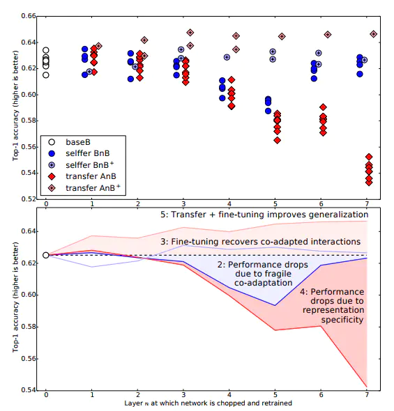

## Auto-LR

这个里面提了一个contradict后两篇！在细看中。。。

> paper：AutoLR: Layer-wise Pruning and Auto-tuning of Learning Rates in Fine-tuning of Deep Networks
>
> author：Youngmin Ro1,2 Jin Young Choi1
>
> institute：1Department of ECE, ASRI, Seoul National University, Korea, 2Samsung SDS, Korea
>
> code： Code is available at https://github.com/youngminPIL/AutoLR.
>
> ---
>
> main：1先移除贡献不大的层，2再根据各个layer的role（general还是specific），在不同层采用不同的学习率（layer-wise）并且在每个epoch更新学习率
>
> ***point1：这里面说预训练模型的高层对新的task帮助不大（因为是对于旧task的specific），这和你的假设符合！！！紧接着又说了adopt的问题，低层对大多数任务都管用而高层则是specific***
>
> ***point2：里面有个说法是低层训练时较大的weight变化破坏了预训练模型原本就有的general能力，这里对上了survey2，保留低层到cache只改高层应该是可行的！***
>
> contradict：文章一开始说反驳低层general高层specific，后面又是基于这个做的工作，可能是写错了
>
> conclusion：
>
> * 引了一些说general/specific的文章
> * 说了高层因为w变化小所以没啥用，剪去高层
> * 说低层w变化大破坏了预训练模型的general，因此分层设学习率(LR)，低层LR小以此保留general，高层LR大来适应新的specific task
> * 每个epoch再不断更新学习率
> * *给了具体的更新参数方法，有开源代码*
>
> 

## transfer （NIPS 2014 talk）

> homepage：[Jason Yosinski](https://yosinski.com/transfer)
>
> paper：How transferable are features in deep neural networks?
>
> author：Jason Yosinski,1 Jeff Clune,2 Yoshua Bengio,3 and Hod Lipson4
>
> code：[yosinski/convnet_transfer: Code for paper "How transferable are features in deep neural networks?" (github.com)](https://github.com/yosinski/convnet_transfer)
>
> ---
>
> main：迁移学习，量化了general和specific，迁移学习效果受任务相似度影响
>
>  * 两种迁移方法：引入高层特征后反向传播做fine-tune/固定低层只训练高层
>
> * ***提到了迁移学习co-adapt性能弱的问题***
> * 讨论了在不同层进行迁移的效果——说明general到specific的转变发生在哪些层——为“保留浅层”到底保留多少层提供指示
>
> conclusion：固定浅层参数（BnB和AnB）随着固定层数上升准确率下降很大，全局微调（BnB+和AnB+）性能一直优异
>
> 

## Visualizing and Understanding Convolutional Networks