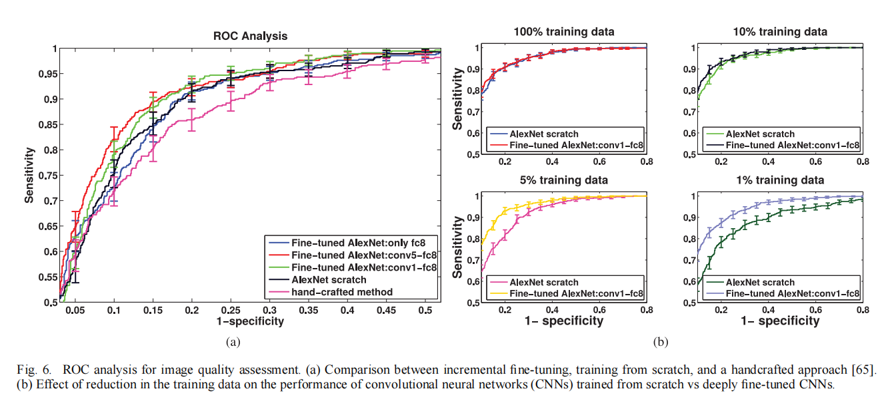

## （survey1）transfer （NIPS 2014 talk）

> homepage：[Jason Yosinski](https://yosinski.com/transfer)
>
> paper：How transferable are features in deep neural networks?
>
> author：Jason Yosinski,1 Jeff Clune,2 Yoshua Bengio,3 and Hod Lipson4
>
> code：[yosinski/convnet_transfer: Code for paper "How transferable are features in deep neural networks?" (github.com)](https://github.com/yosinski/convnet_transfer)
>
> ---

## Full Training or Fine Tuning?

> paper：Convolutional Neural Networks for Medical Image Analysis: Full Training or Fine Tuning?
>
> author：Nima Tajbakhsh*, Member, IEEE*, Jae Y. Shin, Suryakanth R. Gurudu, R. Todd Hurst, Christopher B. Kendall, Michael B.Gotway, and Jianming Liang*
>
> ---
>
> main：
>
> * 对几个不同的医学cv任务，从只微调最高层开始递增（incremental fine-tuning），发现**不同任务需要微调的程度不同**，**全量微调不一定比只微调部分层效果好**。
> * 微调程度还与可用于训练的数据量有关（training data）；training data大的时候 *全量微调 > full train > 浅微调* ，随着data量变小，全量微调比full train会越来越好
> * 全量微调的收敛速度（convergence speed）比full train一个CNN更快
>
> point：
>
> * 不同task需要fine-tune的程度不同，有些只需要FT深层或者中层，有些则需要全局微调，所以需要做“Layer-wise fine-tuning”
> * 也有提到general/specific
> * source和target task差距大时只调深层是不行的（domain adaptation）
> * **提出技巧：从只调最高层开始一层层加（incremental fine-tuning）**
> 
>

## SPoT

> paper：SPoT: Better Frozen Model Adaptation through Soft Prompt Transfer
>
> 这篇其实做的也是prompt pre-training的事情，并研究了prompt的pre-training怎么影响task的transfer。做法很简单，就是在pretraining LM和target task的prompt tuning之间，加了一个prompt pre-training。其实就是在许多source tasks（数据集）上训练一个或者多个prompt，然后用一个或者多个prompt去初始化target task的prompt，然后继续执行target task的prompt tuning。作者还研究了选择怎么样的source tasks更能帮助到target task，本质就是去衡量任务之间的相似度，所以就用source prompt embedding和target prompt embedding的相似度表示。整个实验在T5-base上实验，各种下游任务都被定义为text-to-text，证明了这种方式能够小模型在执行fixed LM+prompt tuning的条件下，也能逼近或者优于fine-tuning的结果，也证明了这种prompt transfer的方式的有效性。PPT也是做的预训练，不过问题就是需要手工设计各种符合下游形式的预训练任务，这篇就不需要，很神奇的一点还有，就算两种task在形式和输入输出上不一样，但是还能起到很好的transfer效果。
